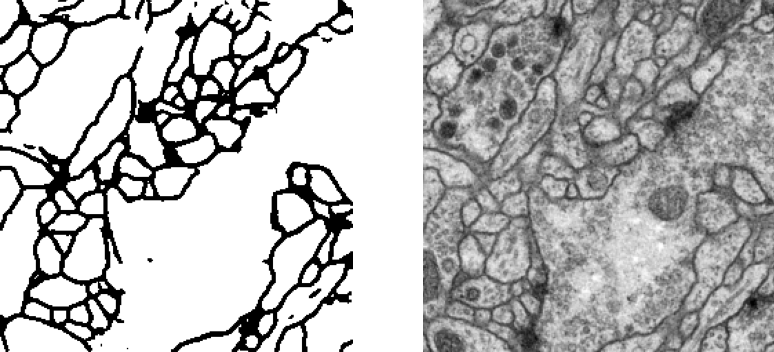
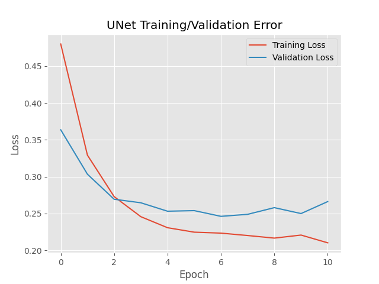

# simple-unet

A simple implementation of the UNet model.

I found myself often needing to implement a UNet architecture as part of some other project, and so decided to put together this simple template for future use.

## Implementation

To ensure the model works as intended, a quick implementation was undertaken. 

Specifically, I chose to implement a 2D segmentation network, via data taken from a Transmission Electron Microscopy (ssTEM) data set of the Drosophila first instar larva ventral nerve cord (VNC). This was obtained via the ISBI challenge: segmentation of of neural structures in EM stacks.

A sample, as shown after 10 epochs of training, is shown above. As seen, after relatively little training, our network (by visually inspecting the output) seems to be functioning correctly. The left-hand side shows the output of the network, and the right-hand side shows the raw original image. Furthermore, a loss plot of training of the model used here is shown below.

